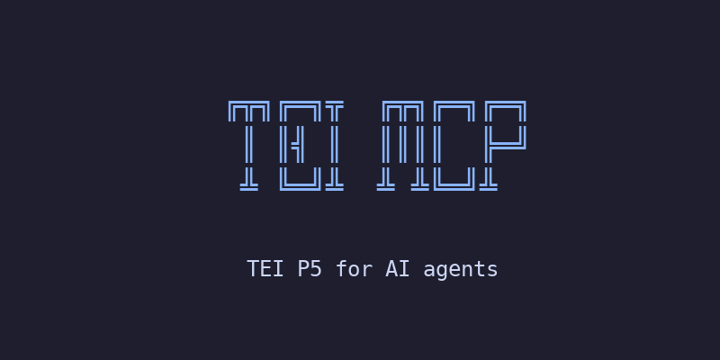

# tei-mcp

<p align="center">
  
</p>

<p align="center">
  <a href="https://doi.org/10.5281/zenodo.19039570"></a>
  <a href="https://pypi.org/project/tei-mcp/"></a>
  <a href="https://github.com/Pantagrueliste/tei-mcp/blob/master/LICENSE"></a>
  <a href="https://modelcontextprotocol.io"></a>
  <a href="https://tei-c.org/guidelines/"></a>
</p>

An [MCP](https://modelcontextprotocol.io) server that helps AI agents read and write valid [TEI](https://tei-c.org/guidelines/) XML. It parses the TEI P5 specification and exposes 16 tools for element lookup, attribute resolution, content model expansion, nesting validation, document validation, and ODD customisation.

## Features

- **Element, class, macro, and module lookup** with case-insensitive matching and typo suggestions
- **Attribute resolution** across the full TEI class hierarchy (local + inherited)
- **Content model expansion** into structured trees with class and macro resolution
- **Nesting validation** (direct parent-child and recursive reachability with path tracking)
- **Document validation** against TEI P5: content models, attributes, closed value lists, reference integrity, deprecation warnings
- **Single-element validation** for incremental editing workflows
- **ODD customisation** support: load a project ODD to constrain the schema (moduleRef filtering, elementSpec delete/change, attDef modifications)
- **Regex search** across all entity types (elements, classes, macros, modules)
- **Deprecation awareness** with validUntil dates and replacement suggestions
- **Attribute suggestion** by intent description (keyword matching against attribute descriptions)
- **Local and remote usage**: all tools work both when the server runs on your machine and when it runs on a remote server

## Requirements

- Python 3.10+
- [uv](https://docs.astral.sh/uv/) (recommended) or pip

## Installation

The quickest way is via [uvx](https://docs.astral.sh/uv/), which fetches and runs the server automatically:

```bash
uvx tei-mcp
```

Or install from PyPI:

```bash
pip install tei-mcp
```

Or clone and install from source:

```bash
git clone https://github.com/Pantagrueliste/tei-mcp.git
cd tei-mcp
uv sync
```

On first run, the server downloads `p5subset.xml` from the TEI website (~5 MB) and caches it locally.

## Usage

### Local server (stdio)

When you run tei-mcp on your own machine, it communicates over stdio. Add the following to your client's MCP server configuration:

```json
{
  "mcpServers": {
    "tei": {
      "command": "uvx",
      "args": ["tei-mcp"]
    }
  }
}
```

Where this file lives depends on your client:

| Client | Configuration file |
|--------|-------------------|
| Claude Desktop | `~/Library/Application Support/Claude/claude_desktop_config.json` (macOS) |
| Claude Code | `.mcp.json` in your project directory |
| Cursor | `.cursor/mcp.json` in your project directory |
| Windsurf | `~/.codeium/windsurf/mcp_config.json` |
| Other clients | Consult your client's MCP documentation |

### Remote server (HTTP)

tei-mcp can also run as a remote HTTP server, so you don't need to install anything locally. Run it with:

```bash
fastmcp run tei_mcp/server.py:mcp --transport streamable-http --host 0.0.0.0 --port 8000
```

Then point your MCP client at the server URL (e.g., `http://your-server:8000/mcp`).

When the server runs remotely, it cannot access files on your computer. Tools that work with documents (`validate_document`, `load_customisation`) accept the XML content directly as a string, so the AI agent can read your local file and send its content to the remote server. See [Working with documents](#working-with-documents) below.

## Tools

| Tool | Description |
|------|-------------|
| `lookup_element` | Look up an element by name (e.g., `persName`) |
| `lookup_class` | Look up a class by name (e.g., `att.global`) |
| `lookup_macro` | Look up a macro by name (e.g., `macro.paraContent`) |
| `list_module_elements` | List all elements in a module (e.g., `namesdates`) |
| `search` | Regex search across all TEI entities |
| `list_attributes` | Resolve all attributes for an element (local + inherited) |
| `class_membership_chain` | Show the full class hierarchy chain |
| `expand_content_model` | Expand content model into a structured tree |
| `valid_children` | List all valid direct children of an element |
| `check_nesting` | Check if an element can appear inside another |
| `check_nesting_batch` | Check multiple nesting pairs in one call |
| `suggest_attribute` | Find relevant attributes by intent description |
| `validate_document` | Validate a TEI XML document against the spec |
| `validate_element` | Validate a single element in context |
| `load_customisation` | Load an ODD customisation |
| `unload_customisation` | Clear the loaded customisation |

Most tools accept `use_odd=True` to query the customised schema instead of the full TEI P5.

## Working with documents

`validate_document` and `load_customisation` both need access to XML files. They support two ways of receiving them:

- **By file path** (`file_path` / `odd_path`): the server opens the file from disk. This is the simplest option when the server runs on your own machine.
- **By content** (`xml_content` / `odd_content`): the XML is passed directly as a string. This is how remote servers work — the AI agent reads your local file and sends its content to the server.

You don't need to choose or configure anything. When you ask the AI agent to validate a document, it will automatically use the right approach depending on whether the server is local or remote.

### Examples

Local server (file path):
```
validate_document(file_path="/path/to/my-document.xml")
load_customisation(odd_path="/path/to/my-project.odd")
```

Remote server (content):
```
validate_document(xml_content="<TEI xmlns='...'>...</TEI>")
load_customisation(odd_content="<TEI xmlns='...'>...</TEI>")
```

`validate_document` also supports authority files (for reference integrity checks) in both forms: `authority_files` for local paths, `authority_contents` for XML strings.

## ODD Customisation

Load a project-specific ODD file to constrain the schema:

```
1. Call load_customisation(odd_path="/path/to/my-project.odd")
   — or load_customisation(odd_content="<TEI>...</TEI>") for remote servers
2. Use use_odd=True on subsequent tool calls
3. Call unload_customisation() to revert to the full spec
```

Supported ODD features:
- `moduleRef` with `include` / `except` filtering
- `elementSpec mode="delete"` to remove elements
- `elementSpec mode="change"` with `attDef` modifications (delete, change, add)
- Closed/semi value list restrictions

## Environment Variables

| Variable | Default | Description |
|----------|---------|-------------|
| `TEI_ODD_PATH` | — | Path to a local `p5subset.xml` (skips download) |
| `TEI_ODD_URL` | TEI-C GitHub URL | Custom URL for the ODD file |

## Development

```bash
# Install dev dependencies
uv sync

# Run tests
uv run pytest

# Run tests with coverage info
uv run pytest -v
```

## License

MIT
