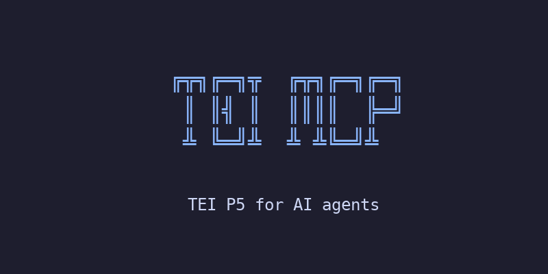

# tei-mcp

<p align="center">
  
</p>

<p align="center">
  <a href="https://doi.org/10.5281/zenodo.19039570"></a>
  <a href="https://pypi.org/project/tei-mcp/"></a>
  <a href="https://github.com/Pantagrueliste/tei-mcp/blob/master/LICENSE"></a>
  <a href="https://modelcontextprotocol.io"></a>
  <a href="https://tei-c.org/guidelines/"></a>
</p>

An [MCP](https://modelcontextprotocol.io) server that helps AI agents read and write valid [TEI](https://tei-c.org/guidelines/) XML. It parses the TEI P5 specification and exposes 21 tools spanning two complementary capabilities: **schema grounding** (element lookup, attribute resolution, content model expansion, nesting validation, document validation, ODD customisation) and **span-locked composition** (annotation of source text without letting the model rewrite the body).

## Features

- **Element, class, macro, and module lookup** with case-insensitive matching and typo suggestions
- **Attribute resolution** across the full TEI class hierarchy (local + inherited)
- **Content model expansion** into structured trees with class and macro resolution
- **Nesting validation** (direct parent-child and recursive reachability with path tracking)
- **Document validation** against TEI P5: content models, attributes, closed value lists, reference integrity, deprecation warnings
- **Single-element validation** for incremental editing workflows
- **ODD customisation** support: load a project ODD to constrain the schema (moduleRef filtering, elementSpec delete/change, attDef modifications)
- **Regex search** across all entity types (elements, classes, macros, modules)
- **Deprecation awareness** with validUntil dates and replacement suggestions
- **Attribute suggestion** by intent description (keyword matching against attribute descriptions)
- **Span-locked composition** with a byte-equality body-text invariant: the model annotates source plaintext by registering tag offsets, and the composer assembles the final TEI without ever letting the model rewrite the body. See [Span-Locked Composition](#span-locked-composition) below.

## Requirements

- Python 3.10+
- [uv](https://docs.astral.sh/uv/) (recommended) or pip

## Installation

The quickest way is via [uvx](https://docs.astral.sh/uv/), which fetches and runs the server automatically:

```bash
uvx tei-mcp
```

Or install from PyPI:

```bash
pip install tei-mcp
```

Or clone and install from source:

```bash
git clone https://github.com/Pantagrueliste/tei-mcp.git
cd tei-mcp
uv sync
```

On first run, the server downloads `p5subset.xml` from the TEI website (~5 MB) and caches it locally.

## Usage

tei-mcp works with any MCP-compatible client. Add the following to your client's MCP server configuration:

```json
{
  "mcpServers": {
    "tei": {
      "command": "uvx",
      "args": ["tei-mcp"]
    }
  }
}
```

Where this file lives depends on your client:

| Client | Configuration file |
|--------|-------------------|
| Claude Desktop | `~/Library/Application Support/Claude/claude_desktop_config.json` (macOS) |
| Claude Code | `.mcp.json` in your project directory |
| Cursor | `.cursor/mcp.json` in your project directory |
| Windsurf | `~/.codeium/windsurf/mcp_config.json` |
| Other clients | Consult your client's MCP documentation |

### Standalone

```bash
uvx tei-mcp
```

The server communicates over stdio using the MCP protocol.

## Tools

| Tool | Description |
|------|-------------|
| `lookup_element` | Look up an element by name (e.g., `persName`) |
| `lookup_class` | Look up a class by name (e.g., `att.global`) |
| `lookup_macro` | Look up a macro by name (e.g., `macro.paraContent`) |
| `list_module_elements` | List all elements in a module (e.g., `namesdates`) |
| `search` | Regex search across all TEI entities |
| `list_attributes` | Resolve all attributes for an element (local + inherited) |
| `class_membership_chain` | Show the full class hierarchy chain |
| `expand_content_model` | Expand content model into a structured tree |
| `valid_children` | List all valid direct children of an element |
| `check_nesting` | Check if an element can appear inside another |
| `check_nesting_batch` | Check multiple nesting pairs in one call |
| `suggest_attribute` | Find relevant attributes by intent description |
| `validate_document` | Validate a TEI XML file against the spec |
| `validate_element` | Validate a single element in context |
| `load_customisation` | Load an ODD customisation file |
| `unload_customisation` | Clear the loaded customisation |
| `get_source` | Return source plaintext for a span-locked document |
| `tag_span` | Record a TEI tag at a character range over the source |
| `compose` | Assemble final TEI from recorded tags; enforces body-text byte-equality |
| `list_tags` | List currently recorded tags for a document |
| `reset_tags` | Clear recorded tags for a document |

Most schema-grounding tools accept `use_odd=True` to query the customised schema instead of the full TEI P5. The span-locked tools (`get_source`, `tag_span`, `compose`, `list_tags`, `reset_tags`) require `TEI_MCP_SPAN_SOURCE_ROOT` to be configured (see [Span-Locked Composition](#span-locked-composition)).

## ODD Customisation

Load a project-specific ODD file to constrain the schema:

```
1. Call load_customisation("/path/to/my-project.odd")
2. Use use_odd=True on subsequent tool calls
3. Call unload_customisation() to revert to the full spec
```

Supported ODD features:
- `moduleRef` with `include` / `except` filtering
- `elementSpec mode="delete"` to remove elements
- `elementSpec mode="change"` with `attDef` modifications (delete, change, add)
- Closed/semi value list restrictions

## Span-Locked Composition

A pattern for using language models to encode TEI without letting them rewrite the source.

In standard generation, a model is asked to produce TEI directly from a piece of source text. The model often produces output that *looks* correct but silently modifies the body — modernised spelling (`mesme` → `même`), dropped commas, archaic pronouns substituted (`luy` → `lui`), or wholly invented passages. Validators downstream cannot catch these errors: the output is well-formed and schema-valid, and only character-level diffing against the source surfaces the discrepancy. For archival workflows where the encoded text becomes a permanent record, this is the failure mode that matters most.

Span-locked composition prevents this **by construction**. The model never types body text. It retrieves the source through `get_source`, registers tags as offset ranges over that source through `tag_span`, and then asks the server to assemble the final TEI through `compose`. The composer interleaves the recorded tags with the source plaintext and verifies byte-by-byte that the rendered TEI's flat text content equals the source before returning. If the model's tags would yield a document whose body text differs from the source, `compose()` raises rather than returning a corrupted document.

This is complementary to schema grounding. The schema-grounding tools (`validate_document`, `lookup_element`, `valid_children`, etc.) help the model produce *valid* TEI; span-locked composition guarantees that the body text inside that TEI is *faithful* to the source. The two together cover both axes a deployable encoding workflow has to satisfy.

### Configuration

Set `TEI_MCP_SPAN_SOURCE_ROOT` to a directory containing source plaintext files. Each file's stem becomes its document ID (e.g., `letter_001.txt` is addressed as `letter_001`). Source files are loaded lazily on first reference and cached for the lifetime of the server process.

```bash
export TEI_MCP_SPAN_SOURCE_ROOT=/path/to/sources
uvx tei-mcp
```

### Workflow

1. Call `get_source("letter_001")` to retrieve the immutable body text.
2. Issue one or more `tag_span("letter_001", start, end, element_path, attrs)` calls to register tags at character offsets.
3. Call `compose("letter_001")` to obtain the final TEI fragment, with the body-text byte-equality check enforced.
4. Optionally call `list_tags` to inspect, or `reset_tags` to start over.

`element_path` is a slash-separated path documenting nesting context (e.g. `TEI/text/body/p/persName`); only the last segment becomes the element's local name. The rest is recorded for provenance.

### Limitations

- Recorded tags are kept in process memory and do not survive server restart.
- `compose()` does not currently check that the registered tags are admissible per the loaded ODD customisation. Validate the composed output with `validate_document` as a separate step if schema validity matters for your workflow.
- Source files are read from disk at first reference, so the source-root directory must be readable at the time `get_source` is invoked.

## Environment Variables

| Variable | Default | Description |
|----------|---------|-------------|
| `TEI_ODD_PATH` | — | Path to a local `p5subset.xml` (skips download) |
| `TEI_ODD_URL` | TEI-C GitHub URL | Custom URL for the ODD file |
| `TEI_MCP_SPAN_SOURCE_ROOT` | `./span_sources` | Directory containing source plaintext files for span-locked composition. Files are addressed by filename stem. |

## Development

```bash
# Install dev dependencies
uv sync

# Run tests
uv run pytest

# Run tests with coverage info
uv run pytest -v
```

## License

MIT
